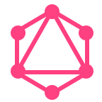

# Hi 👋, I'm Josenaldo de Oliveira Matos Filho

My name is Josenaldo but you can call me JOM. I'm a software developer based in Uberlândia, Minas Gerais, Brasil. I specialize in full stack development and have more than 20 years of experience.

## 🛠️ Skills & Proficiencies

Throughout my career, I've gained a wide array of technical skills, varying in levels of proficiency. I've categorized them into four main groups to provide a clear understanding of my capabilities:

### Fluent

These are the skills with which I'm entirely comfortable and can start working immediately without the need for review or reference. I am highly proficient and up-to-date with the current practices.

    
    
    
    
    
    
    
  

### Proficient (Requires Review)

These are skills I've extensively worked with in the past but might require some time to review and update myself on the latest practices and techniques before I can work effectively with them again.

  

    
    
Java

  

  

    
    
EJB

  

  

    
    
Swing

  

  

    
    
JPA

  

  

    
    
JDBC

  

  

    
    
Spring

  

  

    
    
Spring Boot

  

  

    
    
Spring Security

  

  

    
    
Spring MVC

  

  

    
    
Spring Data

  

  

    
    
Hibernate

  

  

    
    
Maven

  

  

    
    
Mysql

  

### Familiar (Requires Practice)

These are skills I'm familiar with and have some degree of experience with, but would need some time to practice and deepen my proficiency before I could work effectively with them.

  

    
    
Nodejs

  

  

    
    
ExpressJS

  

  

    
    
Python

  

  

    
    
Django

  

  

    
    
Pandas

  

  

    
    
PostgreeSQL

  

  

    
    
Git

  

  

    
    
Docker

  

### Learner (Requires Learning)

These are the technologies I'm actively learning and working to add to my skill set.

  

    
    
ChatGPT

  

  

    
    
GraphQL

  

  

    
    
Typescript

  

  

    
    
MongoDB

  

  

    
    
AWS

  

## 🛠️ Experience, Projects and Education

Throughout my career in software development, I've gathered a diverse range of experiences and have continually invested in my learning.

For a comprehensive overview of my experience, portfolio, blog, and the courses I've engaged in, please visit my personal website at [josenaldo.github.io](https://josenaldo.github.io).

In a nutshell:

- Although I haven't completed a formal degree in the field, I am constantly enriching my knowledge and skills through various courses, especially in the last 2 years.
- I've worked in the industry for over 15 years.
- I've had the opportunity to work extensively with languages like Java, JavaScript, and Python.
- At present, I'm concentrating on full-stack JavaScript development, with a particular focus on React and Express.

I invite you to explore my website for a closer look at my journey and my work!

## 📫 How to reach me

I'm always open to new opportunities and connections. If you'd like to get in touch, please feel free to reach out to me via any of the following channels:

  

    
  

  

    
  

  

    
  

  

    
  

## 📊 GitHub Stats

Is anyone else obsessed with GitHub stats? I love seeing the stats of other developers, so I thought I'd share mine as well.

## 💡 Fun Facts

- I am exclusively a remote worker, embracing the flexibility and unique challenges it brings.
- Thrice a week, I undergo hemodialysis treatments, but I don't let it slow me down!
- My wife and I are proud caretakers of 34 cats and a dog. If you're located in Uberlândia - MG, Brazil, and are interested in adopting a cat, please feel free to reach out.
- I'm an enthusiastic gamer, movie buff, and anime fan. I love indulging in all things geeky, particularly during my hemodialysis sessions!
- I hold the unique distinction of being the only person in the world who "lost" my mother-in-law's kidney!

<!--- snake -->
<picture>
  <source media="(prefers-color-scheme: dark)" srcset="https://github.com/josenaldo/josenaldo/blob/output/github-snake-dark.svg" />
  <source media="(prefers-color-scheme: light)" srcset="https://github.com/josenaldo/josenaldo/blob/output/github-snake.svg" />
  
</picture>
